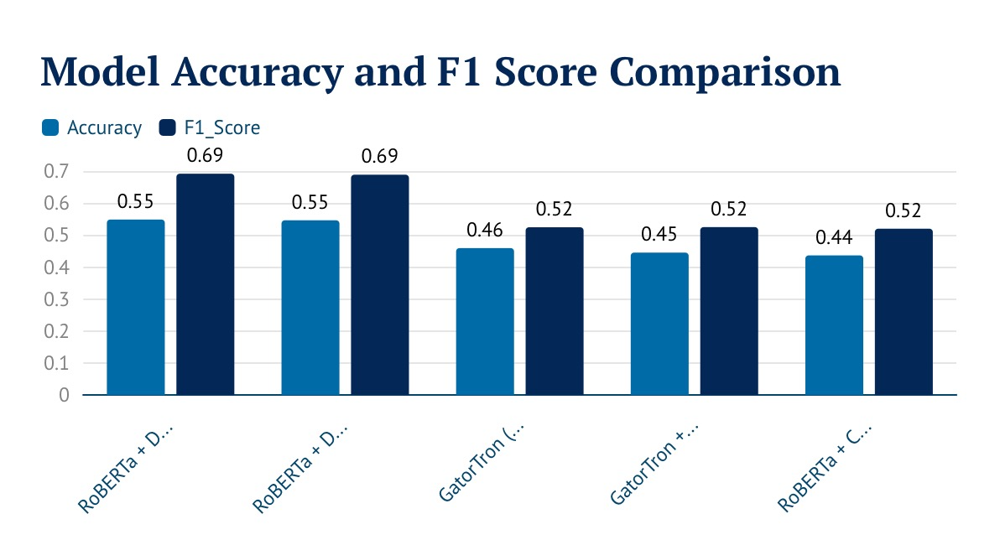
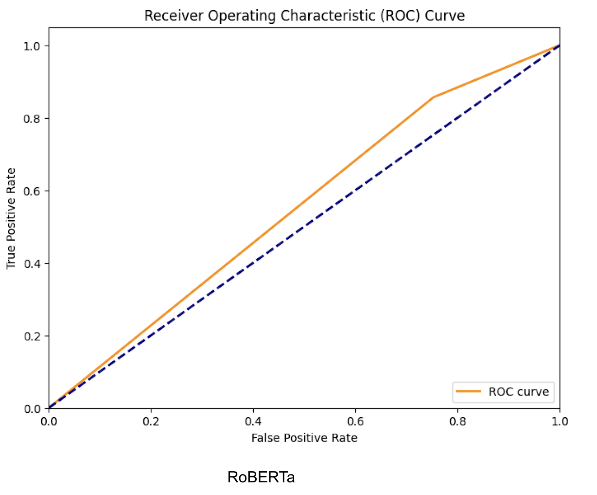

     📦 **Releases**: See [v1.0.0 – Initial Public Release](../../releases/latest) for reproducible code, instructions, and datasets.


<p align="center">
  
  
</p>

<p align="center"><em>Research collaboration between the University of Aberdeen and NHS Grampian</em></p>


# 🛠️ Predicting Surgical Selection for Arthroplasty: A Comparative Analysis of NLP Models


  
  
 
 

 
  
[](LICENSE) 
 


 

This project investigates the use of Natural Language Processing (NLP) models to predict patient surgical selection from pre-operative radiology reports. The aim is to evaluate the performance of advanced transformer models (e.g., GatorTron, RoBERTa) on this classification task using a rigorous cross-validation approach to ensure reproducibility and robustness.  

The project framework originates from **Dr. Luke Farrow’s GatorTron model**, developed within the **SHAIP secure environment** on real clinical data. To enable open experimentation and sharing, this repository adapts that pipeline using **synthetic radiology report data** and includes modifications with additional models such as **RoBERTa variants**. We also thank the developers of **PyTorch**, **Hugging Face**, **scikit-learn**, and other open-source libraries that made this work possible.  

---

##  Project Workflow & Repository Structure

The repository is structured to reflect the project's workflow:

- - `src/` : Contains all refactored Python scripts for data loading, modeling, and evaluation.  
   Includes a `private_data_processing/` subfolder with R scripts used for initial data linkage (no patient identifiers included).  
- `notebooks/` : Stores Jupyter notebooks used for initial model development and exploratory analysis.  
- `data/` : Placeholder for the dataset. The original SHARP dataset cannot be shared. A **synthetic dataset** that mimics its statistical properties is provided for reproducibility.  
- `models/` : Directory for saved model weights (not committed to GitHub).  
- `images/` : Contains exported figures such as dashboards, confusion matrices, and ROC curves for the README.  


---
## 🚀 Quickstart

```bash
pip install -r requirements.txt
python train.py --csv data/hip_radiology_reports_finalised_SYNTH.csv --model UFNLP/gatortron-base --folds 3
```
---


## Acknowledged Contributions and Modifications

This project builds upon the original work to create a more robust and comprehensive machine learning pipeline. The key modifications include:

- **Synthetic Data Generation**:  
  The original scope of this placement was to develop and evaluate models on **real clinical radiology reports within the SHAIP secure environment**.  
  Due to delays and access restrictions, a **synthetic dataset** was generated to mimic the statistical structure of the real data. This approach ensures reproducibility while protecting patient confidentiality. The methods, models, and evaluation framework developed here are directly transferable to the real dataset once access is available.

- **Enhanced Code Structure**:  
  The pipeline was refactored into distinct, logical modules for data generation, preprocessing, model setup, training, and evaluation, improving readability and maintainability.

- **Improved Evaluation Workflow**:  
  The script now calculates and reports average metrics with 95% confidence intervals across all cross-validation folds, providing a more robust view of model performance.

- **Comprehensive Visualization**:  
  Additional plotting functions were introduced, including aggregated ROC curves, average confusion matrices, calibration plots, and dashboard-style summaries.

- **Increased Robustness**:  
  Error handling was added for critical operations such as file loading, ensuring smoother execution and clearer debugging feedback.

---

## 🔑 Key Findings and Model Performance  

The analysis investigated the effectiveness of different model variants and strategies for both the **Surgical Selection** and **MCID Classification** tasks.  

---

### 🦴 Surgical Selection (Operated On)  

The most effective strategy was combining the **RoBERTa model with data augmentation**, as demonstrated by metrics from a 3-fold cross-validation run.  

| Model Variant                          | F1 Score | Accuracy | Recall | Precision |
|----------------------------------------|----------|----------|--------|-----------|
| **RoBERTa + Data Augmentation**        | **0.6917** | 0.5485   | **0.9779** | 0.5355    |
| RoBERTa + Data Augmentation + Weight Decay | 0.6886 | 0.5462   | 0.9691 | 0.5351    |
| GatorTron + Class Weighting            | 0.5249   | 0.4452   | 0.8762 | 0.3771    |
| GatorTron Baseline                     | 0.5244   | 0.4593   | 0.8564 | 0.3779    |
| RoBERTa + Class Weighting              | 0.5199   | 0.4365   | 0.8746 | 0.3703    |

📌 **Insight:**  
Data augmentation significantly boosted the model’s ability to identify positive cases (high recall). However, this came with a trade-off in **precision**, leading to frequent false positives — a key area for future optimization.  

---

### 📊 MCID Classification (Minimal Clinically Important Difference)  

Models were developed using both **GatorTron** and **RoBERTa** to predict MCID, a key patient-reported outcome.  
Both were trained and evaluated using **stratified cross-validation with class weighting and a weighted random sampler** to address class imbalance.  

| Model Variant                | Mean AUROC | Mean AUPRC | F1 (No MCID) | F1 (Yes MCID) | Accuracy |
|-------------------------------|------------|------------|--------------|---------------|----------|
| **GatorTron (5-Fold)**        | **0.552**  | 0.473      | 0.565        | 0.540         | 0.558    |
| GatorTron Baseline (Single Split) | 0.523   | 0.453      | 0.530        | 0.530         | 0.530    |
| **RoBERTa (5-Fold)**          | 0.532      | **0.481**  | 0.530        | **0.568**     | 0.549    |
| RoBERTa Baseline (Single Split) | 0.551   | 0.475      | 0.460        | 0.590         | 0.540    |

📌 **Notes:**  
- “5-Fold” = mean metrics from 5-fold cross-validation.  
- “Baseline (Single Split)” = metrics from a single 80/20 train-validation split.  
- GatorTron (5-Fold) used **class weighting** for imbalance handling.  

---

### 📊 Example Visualizations  

- **Performance Dashboard Example**: Overall Accuracy and F1 score comparison.  
- **Confusion Matrix Example**: Error type distribution across classes.  
- **ROC Curve Example**: Discrimination ability across thresholds.  

**Performance Dashboard Example:**  


**Confusion Matrix Example:**  


**ROC Curve Example:**  


---

## 📉 How to Reproduce the Analysis

This project is fully reproducible. Please follow these steps in order:

### Step 1: Clone Repository & Install Dependencies

```bash
git clone https://github.com/somaia-e/Predicting-Surgical-Selection-for-Arthroplasty.git
cd Predicting-Surgical-Selection-for-Arthroplasty
pip install -r requirements.txt
```
Step 2: Run the Scripts
Navigate to the src directory and execute the main training and evaluation script:
cd src
python train_and_evaluate.py

👩🏻‍💻 Future Work
Advanced Data Augmentation: Explore more sophisticated techniques beyond random insertion to improve model generalization.
Hyperparameter Tuning: Conduct a more extensive search to find the optimal combination of learning rates, batch sizes, and epochs for the best-performing models.
Error Analysis: Perform a deeper analysis of false positive predictions to understand their root causes and develop strategies to mitigate them.

## 📜 License
This project is available under the MIT License. See the [LICENSE](LICENSE) file for details.  
