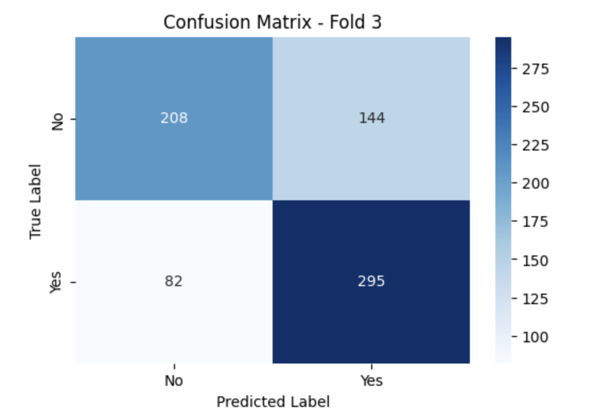
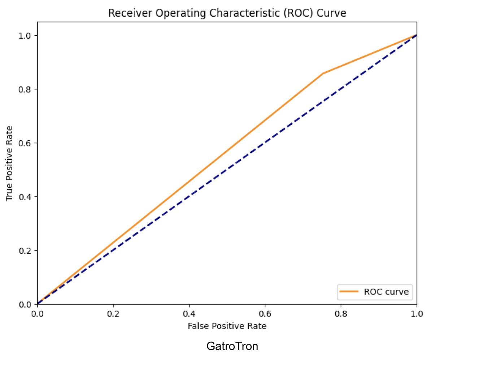

# Predicting Surgical Selection for Arthroplasty: A Comparative Analysis of NLP Models

This project investigates the use of Natural Language Processing (NLP) models to predict patient surgical selection from pre-operative radiology reports. The core objective is to evaluate the performance of advanced transformer models on this classification task, using a rigorous cross-validation approach to ensure reproducibility and robustness.

The project was built upon a foundational code script generously provided by **Dr. Luke Farrow**, which served as the starting point for this analysis. We also thank the developers of **PyTorch**, **Hugging Face**, **scikit-learn**, and other open-source libraries that made this work possible.

---

## 1️⃣ Project Workflow & Repository Structure

The repository is structured to reflect the project's workflow:

- `src/` : Contains all refactored Python scripts for data generation, modeling, and evaluation.  
- `notebooks/` : Stores the original Jupyter notebooks used for initial development and exploratory analysis.  
- `data/` : Placeholder for the dataset. Due to patient privacy, the original SHARP dataset cannot be shared. A **synthetic dataset** that mimics the statistical properties of the original data was created for reproducible analysis.  
- `models/` : Contains the saved, pre-trained model weights.  
- `images/` : Store performance dashboards, confusion matrices, and plots for README.  

---

## 2️⃣ Acknowledged Contributions and Modifications

This project builds upon the original work to create a more robust and comprehensive machine learning pipeline. The key modifications include:

- **Synthetic Data Generation**: A Python script was developed to generate a realistic, synthetic dataset of clinical text and patient outcomes, enabling a fully reproducible analysis while protecting patient privacy.  
- **Enhanced Code Structure**: The code was refactored into distinct, logical sections for data generation, model setup, training, and evaluation.  
- **Improved Evaluation Workflow**: The script now calculates and reports overall average metrics and their 95% confidence intervals across all cross-validation folds.  
- **Comprehensive Visualization**: New plotting functions were added to generate an aggregated ROC curve, average confusion matrix, and a calibration plot.  
- **Increased Robustness**: The script now includes error handling for critical operations like file loading.  

---

## 3️⃣ Key Findings and Model Performance

The most effective strategy was combining the **RoBERTa model with data augmentation**, as demonstrated by the metrics from a 3-fold cross-validation run.

| Model Variant                              | F1 Score | Accuracy | Recall  | Precision |
|--------------------------------------------|----------|----------|---------|-----------|
| RoBERTa + Data Augmentation                | 0.6917   | 0.5485   | 0.9779  | 0.5355    |
| RoBERTa + Data Augmentation + Weight Decay | 0.6886   | 0.5462   | 0.9691  | 0.5351    |
| GatorTron + Class Weighting                | 0.5249   | 0.4452   | 0.8762  | 0.3771    |
| GatorTron Baseline                         | 0.5244   | 0.4593   | 0.8564  | 0.3779    |
| RoBERTa + Class Weighting                  | 0.5199   | 0.4365   | 0.8746  | 0.3703    |

The analysis revealed that while **data augmentation** significantly improved the model's ability to identify positive cases (high recall), it did so with a notable trade-off in **precision**. The model frequently produced false positives, which is a key area for future improvement.

**Performance Dashboard Example:**  


**Confusion Matrix Example:**  


**ROC Curve Example:**  


---

## 4️⃣ How to Reproduce the Analysis

This project is fully reproducible. Please follow these steps in order:

### Step 1: Clone Repository & Install Dependencies

```bash
git clone https://github.com/somaia-e/Predicting-Surgical-Selection-for-Arthroplasty.git
cd Predicting-Surgical-Selection-for-Arthroplasty
pip install -r requirements.txt
```
Step 2: Run the Scripts
Navigate to the src directory and execute the main training and evaluation script:
cd src
python train_and_evaluate.py

5️⃣ Future Work
Advanced Data Augmentation: Explore more sophisticated techniques beyond random insertion to improve model generalization.
Hyperparameter Tuning: Conduct a more extensive search to find the optimal combination of learning rates, batch sizes, and epochs for the best-performing models.
Error Analysis: Perform a deeper analysis of false positive predictions to understand their root causes and develop strategies to mitigate them.
