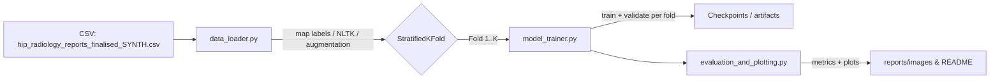

# 📂 Source Code Overview


---

## 🔹 Surgical Selection (`/Surgical Selection/`)  

- **data_loader.py**  
  Loads the dataset (CSV format), maps binary labels (Yes/No → 1/0), applies text augmentation where required, and prepares stratified folds using `StratifiedKFold` for balanced cross-validation.  

- **model_trainer.py**  
  Handles model initialization (e.g., GatorTron, ClinicalBERT), tokenizer loading, and training loops. It also manages cross-validation, learning rate scheduling, and checkpoint saving.  

- **evaluation_and_plotting.py**  
  Computes and visualises performance metrics, including accuracy, precision, recall, F1 score, and AUROC. Generates confusion matrices, ROC curves, and training/validation loss plots.  

---

## 🔹 MCID Classification (`/MCID/`)  

- **data_loader.py**  
  Prepares datasets with binary MCID labels (Yes MCID / No MCID → 1/0). Includes class weighting and weighted random sampling for imbalanced data.  

- **model_trainer.py**  
  Trains models (e.g., GatorTron, RoBERTa) for MCID prediction using stratified 5-fold cross-validation. Supports threshold tuning (e.g., Youden’s J) for optimal classification.  

- **evaluation_and_plotting.py**  
  Computes AUROC, AUPRC, F1 (per class), and accuracy. Produces confusion matrices, ROC curves, PR curves, and loss plots.  

---

## 🔹 Shared Components  

- **__init__.py**  
  Marks the folder as a Python package to allow modular imports.  

- **private_data_processing/**  
  Contains R scripts used for initial data linkage and cleaning within the SHAIP secure environment.  
  ⚠️ All scripts are de-identified and contain **no private patient information**.  

---




```mermaid
flowchart TD
    subgraph Data
        DL[data_loader.py]
        PDP[private_data_processing/]
    end

    subgraph Training
        MT[model_trainer.py]
    end

    subgraph Evaluation
        EP[evaluation_and_plotting.py]
    end

    CSV[(Synthetic CSV)] --> DL
    DL --> MT
    PDP -.-> DL
    MT --> EP
    EP --> Reports[Outputs: metrics, plots, README visuals]
